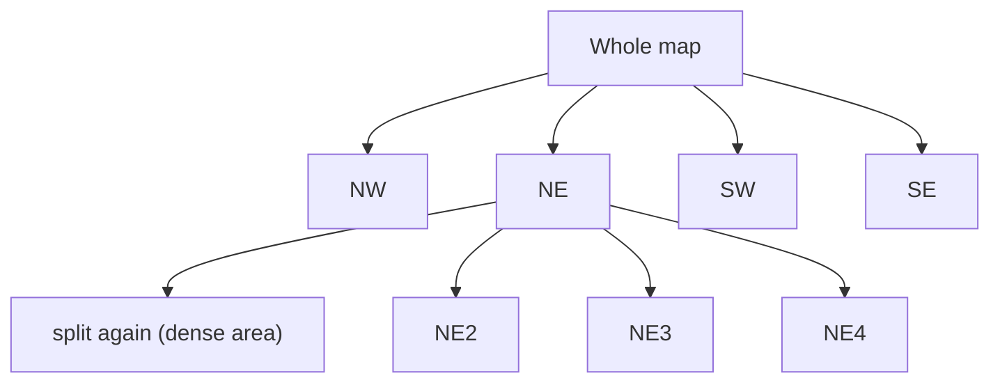
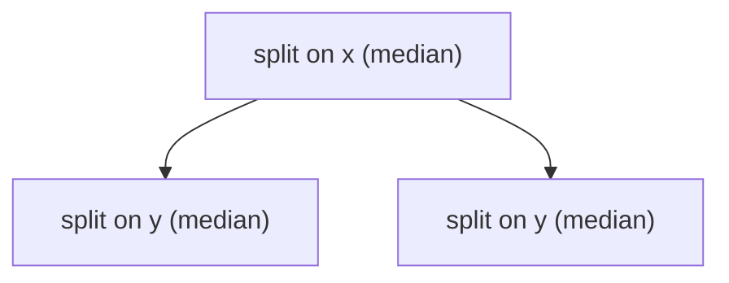
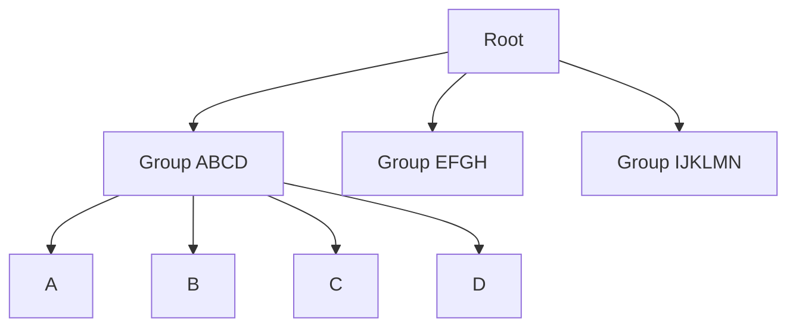
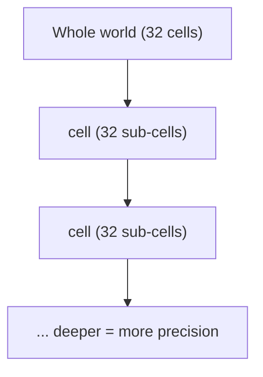

# Proximity Search / Spatial Indexing

## Why it's hard
- Age query (`WHERE age BETWEEN 20 AND 30`) is fast: B-tree keeps sorted keys packed on one page → single seek + sequential read.
- Location query ("drivers within 2km") is slow: lat/long are 2 numbers, but a B-tree only sorts one dimension at a time.
  - Index on lat → horizontal strip. Index on long → vertical strip. Composite index → still sorts by first col, breaks ties with second — effectively 1D.
  - Falls back to brute-force distance calc per row.
- **Root problem**: a 1D sort order can't preserve 2D closeness. Neighbors on the map can land far apart in the index.
- **Universal truth**: a spatial index never gives the final answer — it turns "check every row" into "check a small candidate set," then you post-filter with exact distance/geometry math.

Two production approaches, chosen by data shape:
- **Geometric data** (polygons, roads, delivery zones — containment/intersection matters) → custom spatial tree (PostGIS, Elasticsearch).
- **Moving points** (drivers, live locations) → encode lat/long into a sortable key for an ordinary index (Redis geo, geohash, S2, H3).

---
## Custom Spatial Trees
Each fixes a flaw in the previous one. Trick: shape the tree like a B-tree on disk (balanced, page-sized nodes).

### Quadtree

- Split each cell into 4 quadrants recursively until leaf has few enough points.
- Search: walk root→leaf comparing to midpoints; candidate set = leaf + neighboring leaves (boundary safety).
- Adapts to density (empty lake = 1 coarse cell; dense Manhattan = deep tree).
- **Problems**: splits at *geometric* midpoint (not data), so dense clusters need many levels → unpredictable/uneven depth. Pointer-based → random disk reads, no page-friendly layout.
- Still used in-memory (map tiles, game collision), not great as an on-disk DB index.

### k-d Tree / BKD Tree

- Alternates splitting dimension (x, y, x, y...), always at the **median** point (not geometric midpoint) → stays balanced at depth log(n) regardless of data distribution (fixes quadtree's Manhattan problem).
- Still pointer-based → same disk problem.
- **BKD tree** fix: pack points into disk-page-sized blocks, built once from a batch → write-once structure. Used by Elasticsearch geo fields.

### R-tree

- Solves two problems: (1) shapes — not just points, but lines/polygons (highways, counties, delivery zones); (2) disk-balance like a B-tree.
- Wraps every object in a **minimum bounding rectangle** (MBR); nearby rectangles nest into larger enclosing rectangles up to the root. Point = zero-size rect, polygon = big box.
- Balanced like B-tree: all leaves same depth, node = 1 disk page, splits/merges keep balance on insert/delete.
- Tradeoff: rectangles **can overlap** (unlike quadtree cells) → query may need to descend multiple branches. R*-tree = refined insertion heuristics to minimize overlap (what most implementations use).
- Production: PostGIS (via Postgres GiST, R-tree-style bounding boxes), SQLite R-tree, Oracle Spatial.
- Best for real geometry (containment/intersection queries). Downside: writes are expensive (rebalancing rectangles); BKD/Elasticsearch is essentially write-once — neither loves churny data.

---
## Encoded Keys
Skip custom trees — flatten lat/long into a sortable cell ID that works on an ordinary B-tree index. Reuses infra every DB already has.

### Geohash

- Recursively divide world into 32 cells per level, base32-encode. 5 chars ≈ 5km, 9 chars ≈ 5m.
- Underneath: just bits (32 options = 5 bits/char). Stored as text (Postgres) or 52-bit int (Redis sorted-set score, via `GEOADD`).
- **Locality property**: shared prefix = nearby (shared cell at that level). Enables `WHERE geohash LIKE 'dr5ru%'` — plain B-tree prefix scan.
- **Boundary bug**: points meters apart can land in different cells/prefixes if straddling a boundary.
  - **Fix — 3x3 trick**: query own cell + 8 neighbors, then post-filter by exact distance.

### S2 (Google)
- Fixes geohash's flat-earth distortion (geohash cells are fat near equator, thin near poles).
- Projects globe onto a cube's 6 faces → roughly equal-area cells everywhere, 64-bit hierarchical ID (truncate = parent cell).
- Handles antimeridian crossing correctly. Used by MongoDB `2dsphere`.

### H3 (Uber)
- Hexagonal cells instead of square: 6 equidistant neighbors (vs. square's 4 edge + 4 farther corner neighbors) → clean "N rings around me" queries, better for heatmaps/dispatch.
- 64-bit hierarchical IDs, but **not** laid out on a space-filling curve like geohash/S2 — close IDs aren't reliably close on the map. Instead, cheap grid math computes exact ring cell IDs directly.
- Dispatch pattern: snap driver to H3 cell (e.g. 200m) → rider's cell + ring(s) → `WHERE h3_cell IN (...)` plain index lookup → post-filter by exact distance.

---
## Which to use
| Data shape | Approach | Examples |
|---|---|---|
| Geometric (polygons, roads, zones; containment/intersection) | Custom spatial tree | PostGIS (GiST/R-tree), Elasticsearch (BKD) |
| Moving points (drivers, live locations) | Encoded key on ordinary index | Redis geo, geohash, S2, H3 |

- Spatial tree: better geometry support, pricier/harder writes (rebalancing, or write-once for BKD).
- Encoded cells: cheap writes (single int update per move), scales to millions of writes/sec, but mostly points-only and always need ring-query + post-filter.
- **Always**: the index narrows to candidates; you always finish with exact distance/geometry math.
