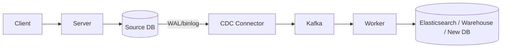
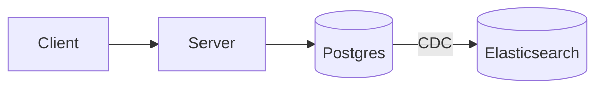
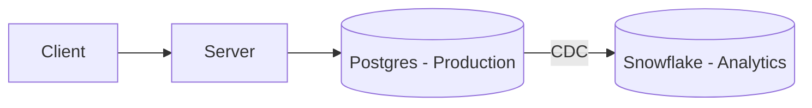
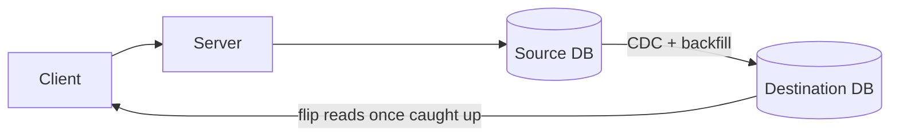

## Summary
CDC captures row-level changes from a database's replication log (Postgres WAL, MySQL binlog) and streams them to downstream consumers, instead of the application writing to those consumers directly. Common tool: Debezium → Kafka → consumer.

## Why it matters
Comes up whenever an interview needs two data stores kept in sync (search index, warehouse, migration). Candidates often reach for CDC even when the consumer needs to know *why* data changed, not just *that* it changed — that's the trap interviewers probe for.

## How it works
App writes only to the source DB. DB commits the change to its log as part of normal transaction processing. A connector (e.g. Debezium) tails that log and publishes change records (before/after image + operation + log offset) to a broker (e.g. Kafka). Consumers apply changes downstream.



Alternatives it replaces, and why they're worse:
- **Dual writes** — app writes to both stores; partial failure = drift, needs retries/idempotency.
- **Polling** — cron job diffs state on a timer; adds DB load, misses granularity, laggy.

CDC record shape (simplified):
```json
{
  "table": "orders",
  "operation": "UPDATE",
  "before": { "id": 123, "status": "PROCESSING" },
  "after":  { "id": 123, "status": "SHIPPED" },
  "offset": { "lsn": "24023128" }
}
```

## Advantages
- No dual-write coordination problem; app only writes to one system.
- Consumers can be added/removed without touching application code.
- Low overhead vs polling — reads only what changed, off the log the DB already maintains.

## Trade-offs
- Row change ≠ business event. A migration/repair script can produce the same diff as a real user action — consumer can't tell them apart from the row alone.
- Not safe for side effects (email, charge a card, trigger workflow) — no idea if change is idempotent-safe to re-fire.
- Extra infra (connector, broker, consumer) vs a direct call the app could've made itself.

## The fit test
Use CDC when the downstream system is a **derived copy** of the source:
1. Source stays authoritative while CDC runs.
2. Some staleness downstream is acceptable.
3. Target can be rebuilt/resynced from source if it drifts or breaks.

### Good fits
**Derived search index** (Postgres → Elasticsearch)

**OLTP → warehouse replication** (Postgres → Snowflake), avoids expensive batch scans

**Zero-downtime DB migration** — start CDC, backfill old→new, apply captured changes, flip reads once caught up


### Bad fits (and what to use instead)
- **"Send email when order ships"** — CDC sees `status = SHIPPED`, not "an OrderShipped event happened" (could be a repair job). Fix: **transactional outbox** — app inserts an `OrderShipped` row with a stable `event_id` in the same transaction as the status update; a relay publishes *that* row. Dedup lives on the event, not the row diff.
- **"Invalidate cache on row change"** — the writer already knows the key that changed; invalidate it inline, or just use a short TTL. Routing through CDC just to rediscover what the writer already knew is overkill.
- **"Run cleanup/background job after a delete"** — same problem as OrderShipped, plus job concerns (retries, backoff, delayed execution/timers) that CDC doesn't solve. Fix: enqueue a durable job, or use a workflow engine (e.g. Temporal) for long-running/delayed/multi-step work.

## Interview Questions
- When would you use CDC vs a transactional outbox?
- Why doesn't deduplicating CDC records solve the "duplicate email" problem?
- How do you handle a zero-downtime migration between two different databases?
- Why is polling worse than CDC for a Postgres → Snowflake pipeline?

## Related Topics
- [[CQRS and Event Sourcing]]
- [[Kafka fundamentals]]
- [[PostgreSQL]]
- [[Caching]]
- [[Long-running Tasks]]
