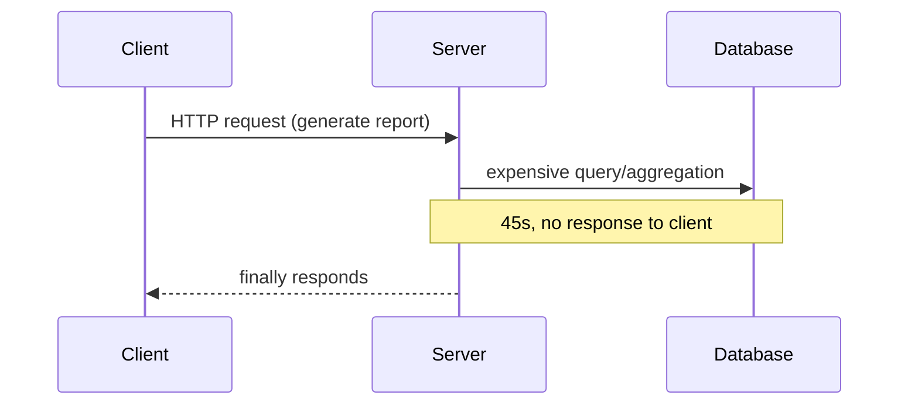
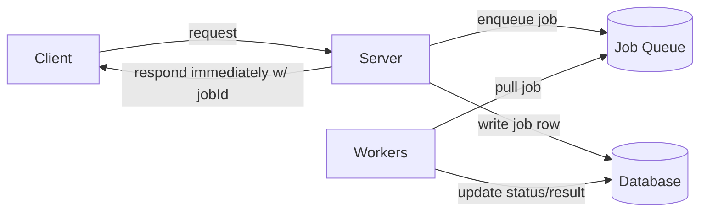
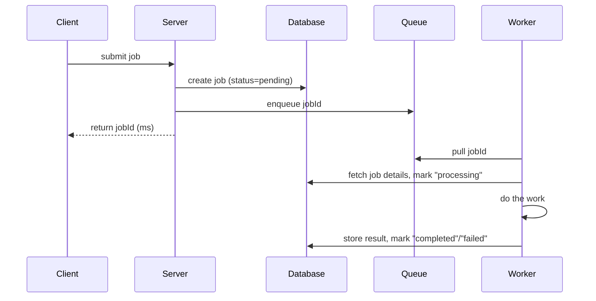
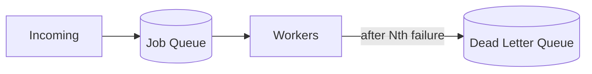

## The Problem

Synchronous requests work fine when the server can respond in <100ms (e.g. a DB query). But operations like PDF report generation, video transcoding, or bulk CSV import can take seconds to minutes. Servers/load balancers enforce ~30-60s timeouts, and even under that, the user just stares at a spinner with no feedback — leading to refreshes/duplicate submissions.

## The Solution — Async Worker Pool

Decouple **request acceptance** from **request processing**. The web server just validates the request, enqueues a job, and returns a job ID immediately (ms). A separate pool of **workers** pulls jobs off a **queue** and does the actual work, updating job status as they go.

Benefits: web servers stay cheap/lightweight (no need for GPUs just because *some* requests are heavy); workers scale independently on hardware suited to the task (e.g. GPU boxes for video); a worker crash doesn't take down the API.

## Trade-offs

**Gain:** fast response times, independent scaling of web vs. workers, fault isolation (crashed worker ≠ crashed API), better resource utilization (right hardware per workload).

**Lose:** more moving parts (queue + workers + job status tracking), eventual consistency (work isn't done when the API returns), added monitoring surface (queue depth, worker health, failure rates).

New failure modes to plan for: full queue, poison messages, when to stop retrying.

## Implementation

**Message queue** (durable, supports concurrent worker access):
- **Redis + Bull/BullMQ** — simplest, "just works," but memory-first so less durable under hard crashes.
- **AWS SQS** — fully managed, pay-per-message, 1MB msg limit (pass IDs, not payloads).
- **RabbitMQ** — flexible routing, self-hosted, real operational burden.
- **Kafka** — replayable log, high throughput, per-partition ordering. Safest default to name in interviews if you don't have a strong preference.

**Workers** — three ways to run them:
- **Plain servers** — simplest, full control, but you manage idle capacity.
- **Serverless (Lambda/Cloud Functions)** — auto-scales, pay-per-execution, but capped at 15-60 min runtime + cold starts.
- **Containers (K8s/ECS)** — middle ground; more ops complexity than serverless, more flexibility than plain servers.

### Full flow

Each component fails independently without taking down the rest: queue down → jobs pile up as "pending" in DB; workers down → jobs wait in queue; DB issues → workers retry.

**In interviews:** default to Kafka (or a queue you know) + plain server workers unless pushed otherwise. The point is showing you understand the separation of concerns, not debating queue tech.

## When to Use in Interviews

Jump in proactively when you hear signals, don't wait to be asked:
- **Named slow operations** — video transcoding, PDF/report generation, bulk email, data export.
- **The math doesn't work** — e.g. "1M images/day at 10s each" = way more processing time than your web tier can absorb.
- **Mismatched hardware needs** — GPU/ML work living next to simple API requests.
- **"What if it crashes?" / "what about 10x scale?"** — natural openings to introduce async workers.

Examples: YouTube (transcoding, thumbnails, moderation), Instagram (image processing + feed fanout), Uber (ride matching, location updates), Stripe (fraud checks, delayed settlement), Dropbox (virus scan, indexing, preview generation).

## Common Deep Dives

**Handling worker failures** — heartbeat/visibility-timeout mechanism; if a worker stops checking in, the queue assumes it's dead and redelivers the job. Tune the interval: too short → false positives (e.g. GC pauses) and queue chatter; too long → slow recovery. ~10-30s is a reasonable default. (SQS: visibility timeout; RabbitMQ: heartbeat; Kafka: session timeout.)

**Handling repeated failures (poison messages)** — after N retries (typically 3-5), move the job to a **Dead Letter Queue (DLQ)** instead of retrying forever. Isolates broken jobs for human investigation; monitor DLQ growth as a bug signal.

**Preventing duplicate work** — require an **idempotency key** (e.g. userId + action + rounded timestamp) when submitting a job; check for an existing job under that key before creating a new one. Make the work itself idempotent too (safe to retry mid-way).

**Managing backpressure** — under load spikes, queue depth grows and wait times explode. Reject new jobs past a depth threshold ("system busy") and autoscale workers off **queue depth**, not CPU (CPU lags the real signal).

**Mixed workloads (short vs. long jobs)** — a 5-hour job blocking a 5-second one causes head-of-line blocking and uneven worker utilization. Fix: separate queues by duration/type (fast queue: many light workers; slow queue: fewer, beefier workers), or chunk large jobs into smaller units on the same infra.

**Orchestrating job dependencies** — for simple chains, each worker enqueues the next step with full context (so any step can retry independently). For branching/parallel multi-step workflows, reach for a durable execution engine (Temporal, AWS Step Functions, Airflow) rather than hand-rolled chaining — see [[Multi-step Processes]].
