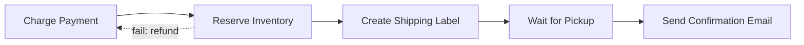
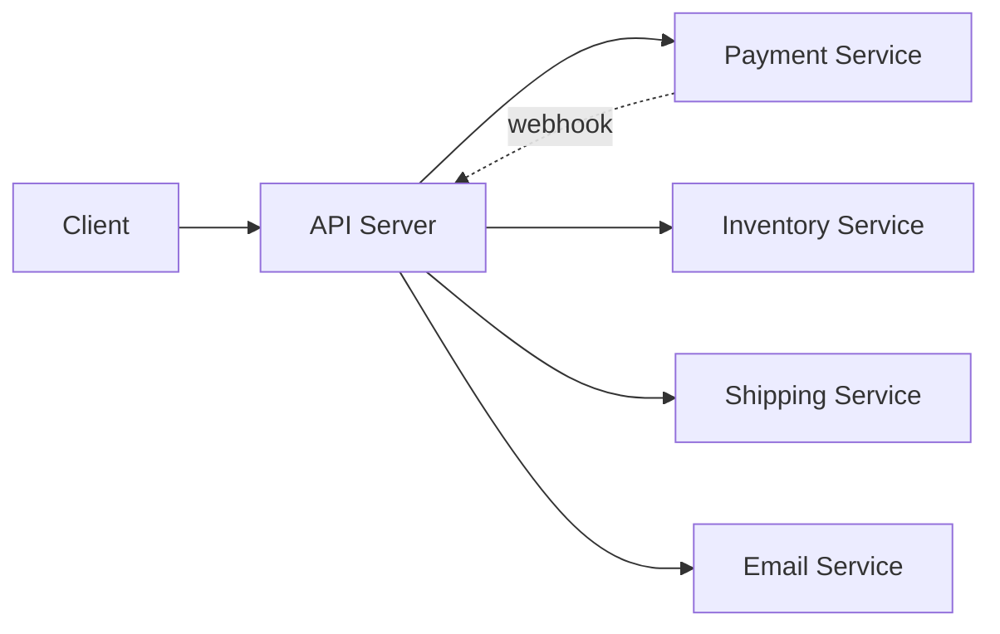
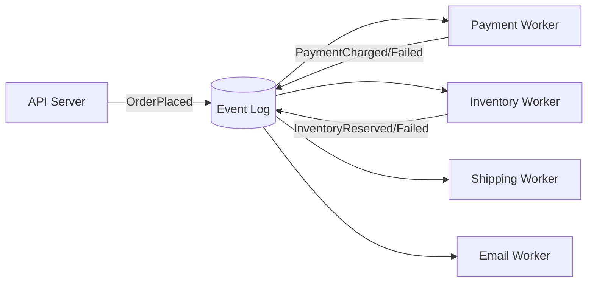
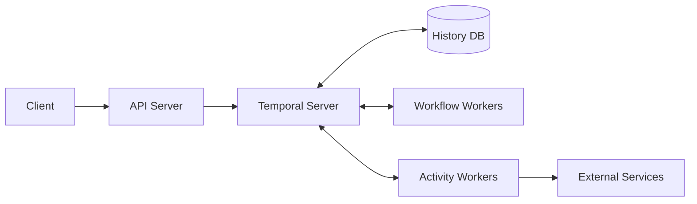

## The Problem

Coordinating a long sequence of steps across flaky services/humans is hard: any step can fail/timeout, servers crash mid-sequence, and business logic gets tangled with failure handling.

**Example — order fulfillment:** Charge Payment → Reserve Inventory → Create Shipping Label → Wait for Pickup (human) → Send Confirmation Email. A downstream failure may need undoing prior steps (e.g. inventory fails → refund payment).

## Solutions (simple → sophisticated)

### 1. Single Server Primitive
One server runs steps top to bottom. Crash = lost progress; scaling out breaks webhook callback routing (callback lands on wrong host).

Patch: checkpoint state to DB + route callbacks via pub/sub — but retries/locking/compensation still hand-rolled.

### 2. Saga Pattern
Sequence of local steps, each with a compensating action. Avoids 2PC/distributed transactions (can't hold locks across flaky external systems).
- **Choreography** — no coordinator; workers react to events, emit new ones. Good for independent teams, mid-complexity flows.
- **Orchestration** — one coordinator owns the flow. Better for complex flows needing central control/visibility.

### 3. Event-Driven Choreography
Durable log (Kafka/Redis Streams) as event store; workers consume/produce events.

- Pros: fault tolerance (consumer group resume), scalability, audit trail.
- Cons: flow is implicit — no single place shows the whole sequence; hard to trace at scale.

### 4. Workflow Orchestration (Durable Execution)
**Durable execution engines** (e.g. Temporal): workflow written as code.
- **Workflow** = deterministic orchestration logic (no side effects).
- **Activity** = actual side-effecting work (must be idempotent — retried on ambiguous failure).
- Recovery = replay: history DB stores each activity's result; replay returns recorded results instead of re-running, so execution resumes exactly where it stopped.
- **Signals** let a workflow wait for external events (approval, webhook) without holding a thread.

**Managed workflow systems** (AWS Step Functions, GCP Workflows): declarative state machine/DAG (JSON/YAML) instead of code. Pro: visualizable. Con: less expressive, must fit the state-machine model. Same underlying guarantees.

**Others:** Azure Durable Functions, Airflow (batch/ETL, not event-driven), DBOS, Hatchet, Netflix Conductor.

## When to Use in Interviews

**Use when:** complex state machine with failure branches; payment systems (no orphan charges); human-in-the-loop flows (ride matching, doc signing, approvals). Listen for "if step X fails, undo step Y" / "all steps or none."

**Skip when:** simple async single-step work (use a plain queue); synchronous/latency-sensitive calls; high-frequency low-value ops (per-activity overhead not worth it).

## Common Deep Dives

- **Crash mid-saga:** checkpoint progress durably; on restart, resume forward or fire compensations. Steps/compensations must be idempotent.
- **Updating a running workflow:**
  - *Versioning* — new code only affects new executions.
  - *Migration* — modify definition in place. Step Functions: running executions pinned to their start definition. Temporal: `patched()` returns true for new/unreached points, false once history already passed it — lets one deploy serve old + new workflows.
- **State size growth:** pass IDs not payloads; use **Continue-as-New** (snapshot state → fresh run with empty history) for long-running/looping workflows.
- **Waiting on external events:** signals + `condition()` with timeouts (e.g. wait 30d → remind → wait 7d → cancel). No thread/memory held while waiting.
- **Exactly-once:** true exactly-once delivery is impossible over a network → engines give at-least-once *attempts*, exactly-once *effect* via idempotency. Pattern: mark key `IN_PROGRESS` before action, `COMPLETED` after; retry: `COMPLETED`→skip, missing→proceed, `IN_PROGRESS`→reconcile manually.
