# Real-Time Updates (System Design)

## The Problem
Real-time systems (chat, collaborative docs, live dashboards) need servers to **push** updates to clients — standard HTTP request/response can't do this. Two distinct sub-problems ("hops"):

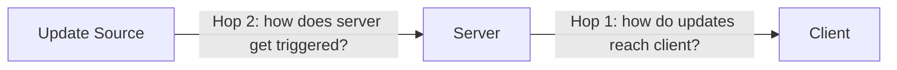

---

## Hop 1: Client ↔ Server Protocols

### Networking primer
- **L3 (IP)**: routing/addressing, best-effort delivery, no ordering/loss guarantees.
- **L4 (TCP/UDP)**: TCP = connection-oriented, ordered, reliable, costly to set up. UDP = connectionless, no guarantees.
- **L7**: HTTP, WebSocket, WebRTC — built on TCP.

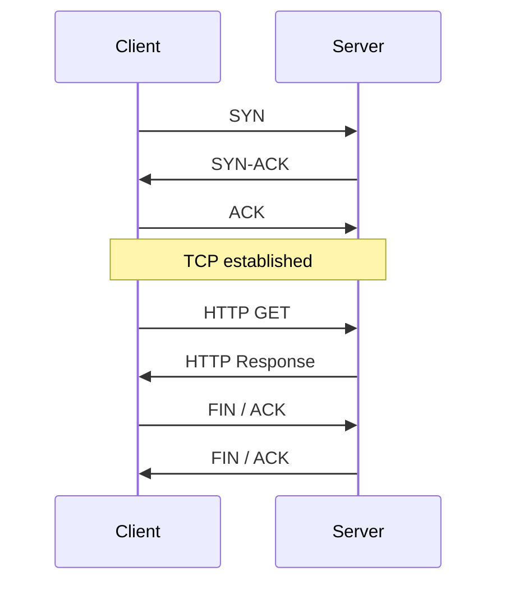
Key takeaways: each round trip adds latency; the TCP connection is state both sides must maintain (keep-alive avoids re-handshaking).

### Load balancers
- **L4 (e.g. AWS NLB)**: routes by IP/port only, preserves one persistent TCP connection client→server. Best for WebSockets.
- **L7 (e.g. AWS ALB)**: terminates and re-opens connections, can route on URL/headers/cookies. More flexible, better for HTTP-style traffic (long polling), spottier WebSocket support.

### Options (from least to most capable)

**1. Simple Polling** — client hits server on a fixed interval.
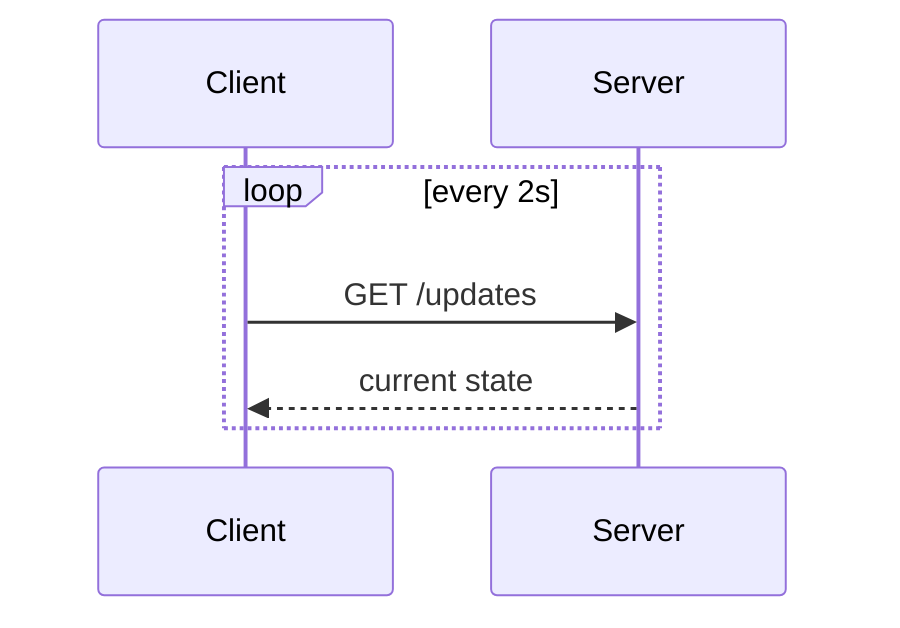
- ✅ dead simple, stateless, no special infra
- ❌ latency ≈ poll interval, wasted requests, DB load
- Use when: not latency-sensitive, or update window is short.

**2. Long Polling** — server holds the request open until data is available, then client immediately re-requests.
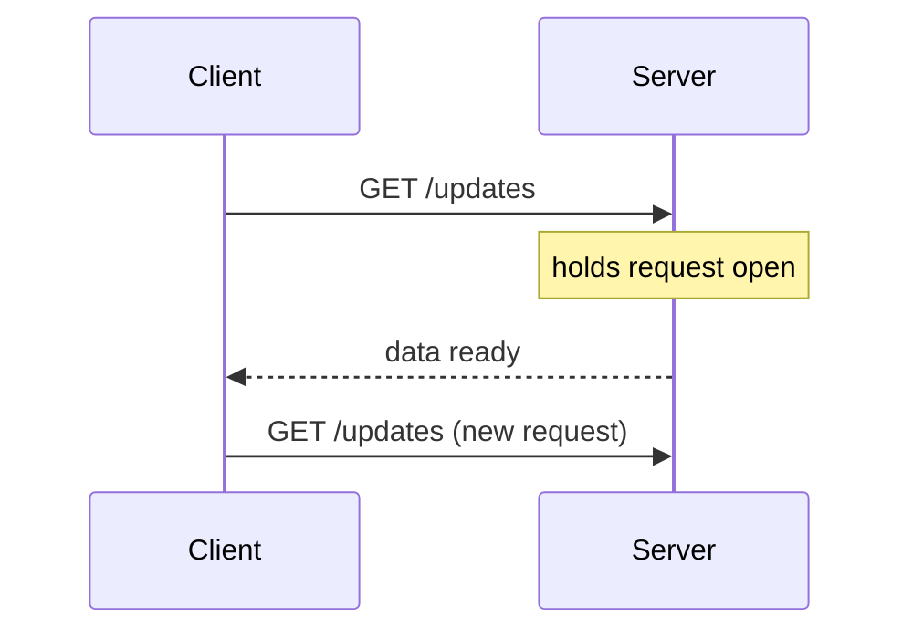
- ✅ builds on plain HTTP, stateless server-side
- ❌ each update requires a fresh round trip → bursty updates arrive with compounding latency; browsers cap concurrent connections/domain
- Use when: infrequent updates or "let me know when this long job finishes" (e.g. payment status).

**3. SSE (Server-Sent Events)** — one HTTP response, sent as an open `chunked` stream; server pushes chunks as they occur.
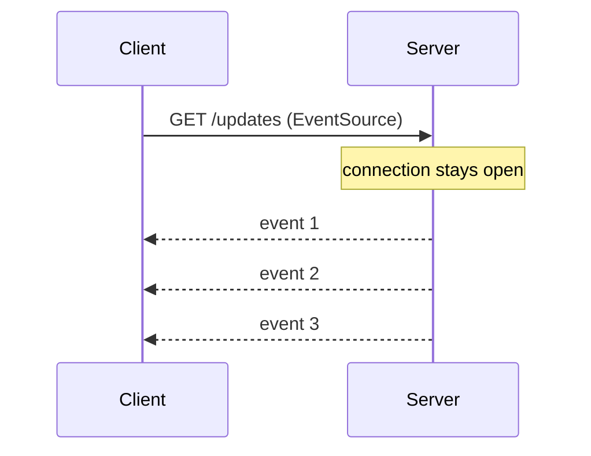
- ✅ native browser support (`EventSource`), auto-reconnect w/ `Last-Event-ID`, efficient (no reconnect per message)
- ❌ one-way only; some proxies/LBs buffer streamed responses (breaks silently); connection caps per domain
- Use when: one-way, moderate-frequency updates — live dashboards, AI token streaming.

**4. WebSockets** — HTTP "Upgrade" to a persistent, full-duplex TCP-like channel.
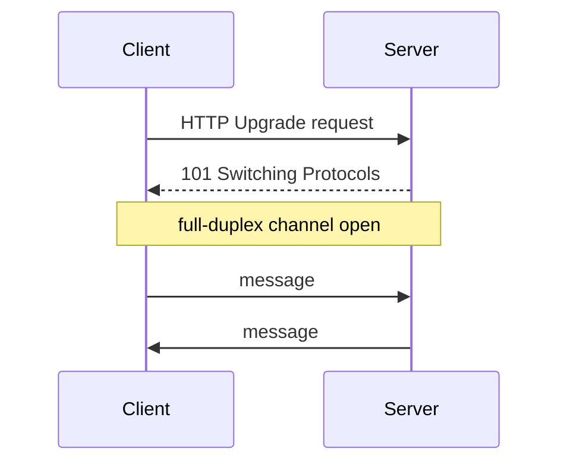
- ✅ full-duplex, low overhead, high frequency
- ❌ needs WS-aware infra end-to-end, stateful connections complicate LB/scaling/deploys, must handle reconnection
- Common pattern to tame statefulness: terminate WS in a dedicated **WebSocket service**, keep everything downstream stateless.
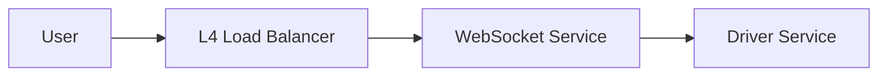
- Use when: high-frequency, bidirectional (chat, collab cursors). Don't reach for it just for server→client push — SSE is usually enough.

**5. WebRTC** — peer-to-peer, browser-to-browser. Signaling server matches peers; STUN does NAT hole-punching; TURN relays as fallback.
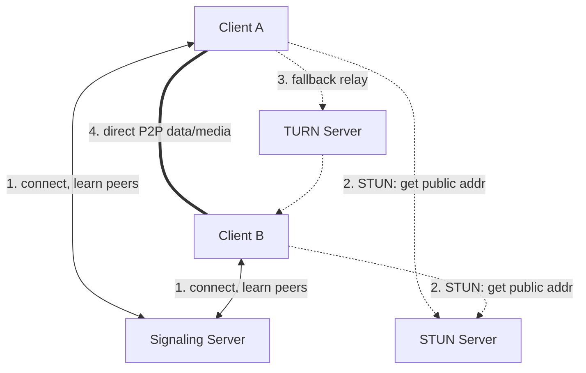
- ✅ direct P2P, lowest latency, offloads server cost, native A/V
- ❌ most complex, needs signaling infra, NAT issues, connection setup delay
- Use when: audio/video calls, or P2P collaboration (e.g. Canva pointers, CRDTs) to cut server load.

### Decision flow
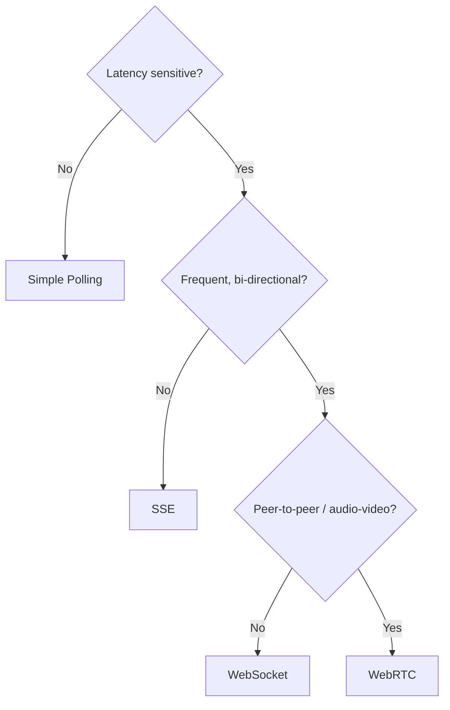

---

## Hop 2: Getting the Server Triggered

### Pull via Polling
Updates land in a DB; clients poll it. Decouples producer from consumer, but reintroduces latency.
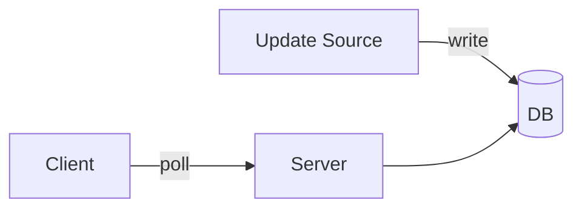
⚠️ Watch read QPS: 1M clients × poll/10s = 100k TPS.

### Push via Consistent Hashing
Persistent-connection servers (WS/SSE) each "own" a subset of users. A coordination service (ZooKeeper/etcd) maps users→servers via a hash ring so scaling only reshuffles a small slice of connections (vs. modulo hashing, which reshuffles almost everyone).
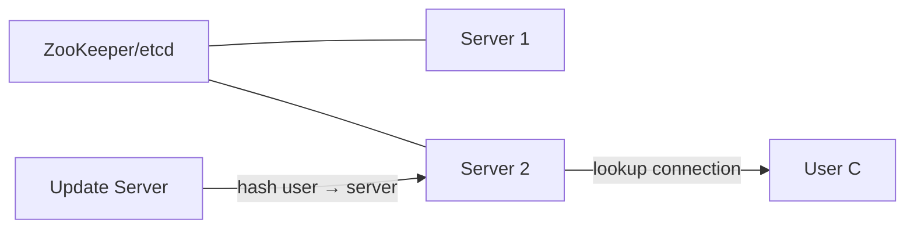
- ✅ predictable placement, minimal churn on scale, good for heavy per-connection state
- ❌ complex, needs coordination service, connection state lost if a node dies
- Use when: connections carry expensive state (e.g. a loaded doc in Google Docs).

### Push via Pub/Sub
Lightweight "endpoint servers" just hold client connections and subscribe to topics on a Pub/Sub layer (Kafka/Redis). Any client can land on any endpoint server — state lives in Pub/Sub, not the servers.
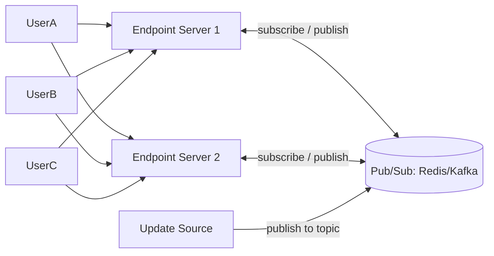
- ✅ endpoint servers stay stateless/interchangeable, easy "least connections" LB, efficient broadcast
- ❌ no visibility into connect/disconnect, Pub/Sub is a SPOF/bottleneck (mitigate w/ Redis Cluster sharding), extra hop latency
- Use when: broadcasting to many clients without needing much per-connection state — default choice for most systems.

---

## Using This in Interviews
- **Proactively** call out real-time needs early: "messages need instant delivery → WebSockets" / "character edits need sub-second propagation."
- **Default to the simplest thing that works.** Polling avoids both hops entirely — great if latency isn't core to the ask.
- Escalation path: Simple Polling → Long Polling → SSE → WebSocket → WebRTC. Don't skip ahead without justification.

### Common scenarios
| Scenario | Hop 1 | Hop 2 |
|---|---|---|
| Chat | WebSocket | Pub/Sub |
| Live comments (celebrity fan-out) | SSE/WS + hierarchical aggregation | Pub/Sub + batching |
| Collaborative doc editing | WebSocket (+ CRDT/OT for conflicts) | Consistent hashing (doc = expensive state) |
| Live dashboards/analytics | SSE | Pull polling or Pub/Sub |
| Gaming | WebRTC (P2P) + WebSocket (coordination) | Pub/Sub |

### Common deep-dive questions
- **Reconnection/failure handling**: heartbeats to detect "zombie" connections; track last-seen sequence/message ID per client so reconnects can backfill (Redis Streams are a common tool).
- **Celebrity fan-out (millions of followers)**: don't fan out writes to every feed — cache once, distribute through regional/hierarchical broadcast layers.
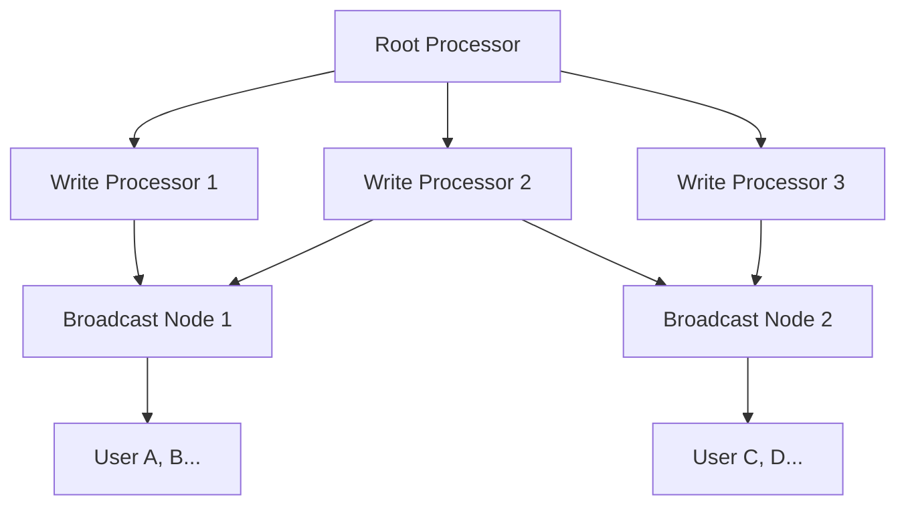
- **Message ordering across distributed servers**: vector clocks/logical timestamps in theory; in practice, for most product-design interviews, funnel related messages through a single server/partition and stamp a total order there.

## Bottom line
Two hops, five client protocols, three propagation patterns. Start simple (polling), escalate only when the problem genuinely demands lower latency or bidirectionality — and always state the trade-off out loud.
