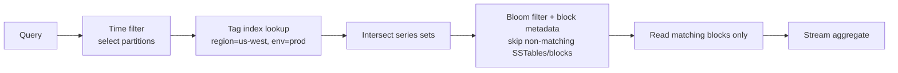

## Summary
Purpose-built stores (InfluxDB, TimescaleDB, Prometheus) for high-volume, append-mostly data points keyed by timestamp + tags (host, region, etc.). Optimize for massive write throughput, time-range queries, and storage efficiency — at the cost of flexibility on other access patterns.

## Why it matters
Comes up in infra-style system design (monitoring/metrics platforms). Tests whether you know **when not to reach for one** — e.g. Top-K problems look time-series-y but need cross-series sort/aggregation, which TSDBs are bad at. Prefer stretching Postgres/DynamoDB until you hit a real bottleneck.

## How it works
Core building blocks (each reusable outside TSDB context):
- **Append-only storage** — never update in place; sequential writes only. Turns random I/O (slow, ~100-200 ops/sec on spinning disk) into sequential I/O (100k+ ops/sec).
- **LSM trees** — writes go to WAL + in-memory sorted memtable → flushed as immutable sorted **SSTable** on disk → background **compaction** merges SSTables. See [[DB Indexing]] for the general mechanism.
- **Delta encoding + compression**:
  - Timestamps: delta-of-delta encoding (regular intervals → deltas of 0 → near-zero bits per timestamp).
  - Values: XOR-based compression between consecutive floats (similar values → mostly zero bits → run-length encoded). Gorilla paper: ~1.37 bytes/value vs 8 bytes raw.
- **Time-based partitioning** — one partition per time window (day/week). Localizes writes (always write to "now" partition), speeds range reads (skip irrelevant partitions), makes retention trivial (drop old partition files instead of DELETE scans).
- **Bloom filters** — per-SSTable, answer "definitely not here" with zero disk I/O; skip files that can't contain the key. ~10 bits/key, ~1% false positive rate. See [[DB Indexing]].
- **Downsampling / rollups** — pre-aggregate (min/max/avg/count) older data at coarser resolution (e.g. 10s raw → 1min → 1hr), trading precision for storage + read speed on historical queries.
- **Block-level metadata** — min/max timestamp (and value) per block enables pruning without reading the block.

**Data model**: measurement (table) + tags (indexed, for filtering — host, region) + fields (unindexed, the actual values) + timestamp. Query path: filter by time → narrow partitions → look up tags in in-memory inverted tag index → intersect series sets → read only matching blocks → stream-aggregate.

**Write path:**
```mermaid
flowchart LR
    W[Incoming write] --> WAL[Write-Ahead Log]
    W --> MT[Memtable\n(sorted, in-RAM)]
    MT -->|full| SST[Flush: immutable SSTable\n(delta + XOR compressed)]
    SST -->|background| C[Compaction\nmerge SSTables, drop tombstones]
```

**Query path** (`WHERE region='us-west' AND env='prod' AND time>now()-1h`):


## Advantages
- 10-100x write throughput vs general-purpose DB for this workload.
- Much smaller storage footprint via delta/XOR compression.
- Range + tag-filtered queries touch only relevant partitions/blocks (physical co-location of series data), unlike row-store scattered reads.

## Trade-offs
- Read amplification — LSM reads may check multiple SSTables.
- Write amplification — compaction rewrites data multiple times.
- **Cardinality problem**: every unique tag combination is a series requiring an in-memory index entry. High-cardinality tags (user_id, request_id) blow up series count (millions of hosts × unique users = billions of series) — must be stored as unindexed fields instead, losing query performance on them.
- Poor fit for cross-series aggregation/sorting (e.g. Top-K across all series).

## Interview Questions
- When would you *not* use a time-series database?
- Why do LSM trees favor writes over reads, and how do Bloom filters/sparse indexes claw back read performance?
- How would you design retention and downsampling policies for a metrics system?
- What's the cardinality problem and how do you avoid it in your data model (tags vs. fields)?

## Related Topics
- [[DB Indexing]] — LSM trees, Bloom filters, B-trees
- [[Sharding]] — time-based partitioning is a specialized sharding strategy
- [[Scaling Writes]]
- [[Kafka fundamentals]] — append-only log parallels

## Notes
- Example data point: `cpu_usage,host=server-1,region=us-west value=45.2 <timestamp>`.
- Rule of thumb: put anything you filter by in tags, anything you're just measuring in fields.
