# Real-Time Updates (System Design)

Real-time systems (chat, collab docs, dashboards) need servers to **push** to clients. Two hops:

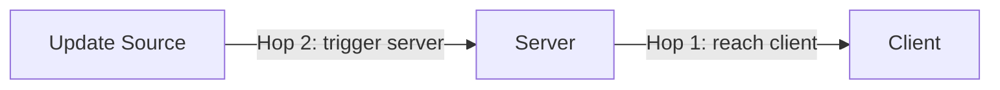

---

## Hop 1: Client ↔ Server

- **L4 LB** (e.g. NLB): sticky TCP conn, best for WebSockets.
- **L7 LB** (e.g. ALB): terminates/re-opens conns, routes on content, better for HTTP-style (polling/SSE), spotty WS support.

### 1. Simple Polling
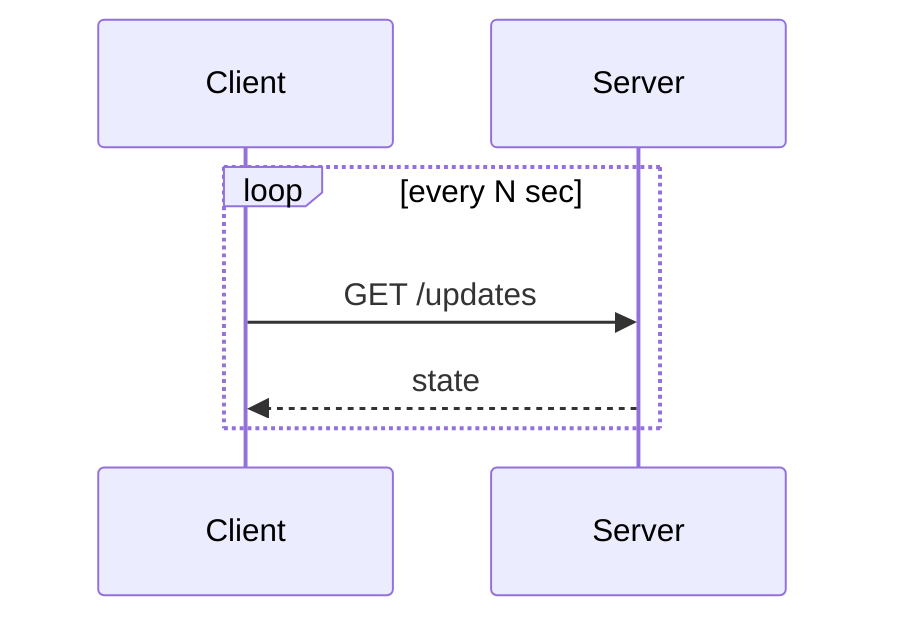
Stateless, zero infra. Latency ≈ interval. Default choice unless latency matters.

### 2. Long Polling
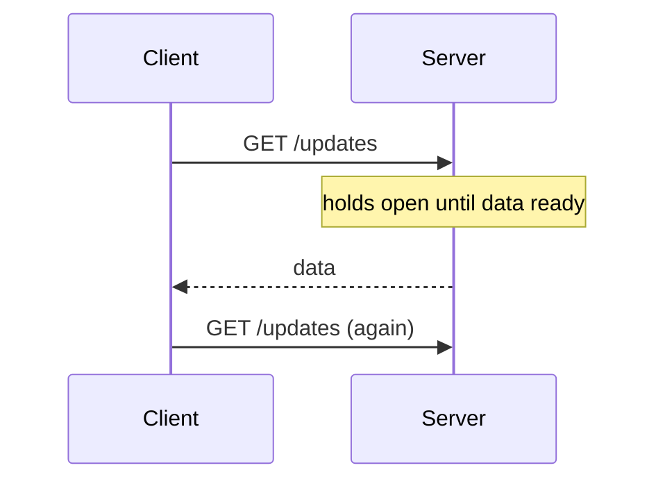
Plain HTTP, stateless server. Bursty updates compound latency (must round-trip per message). Good for "notify me when this finishes" (payment status).

### 3. SSE
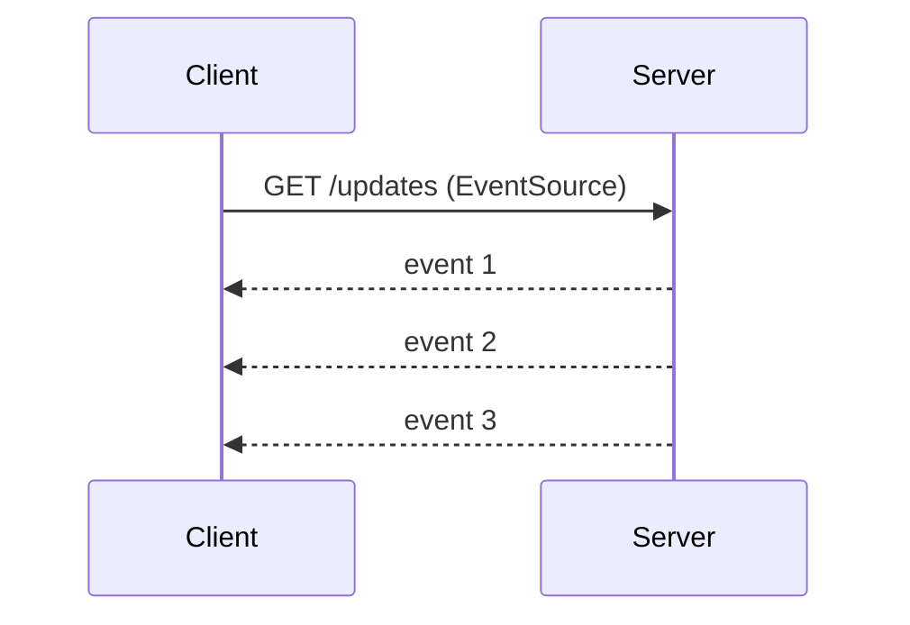
One-way stream, native browser auto-reconnect (`Last-Event-ID`). Proxies that buffer streams break it silently. Good for dashboards, token streaming.

### 4. WebSocket
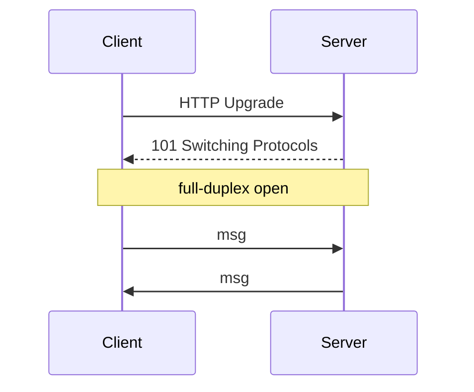
Full-duplex, low overhead. Needs WS-aware infra everywhere; stateful conns complicate LB/scaling/deploys. Terminate into a dedicated WS service to keep the rest stateless:
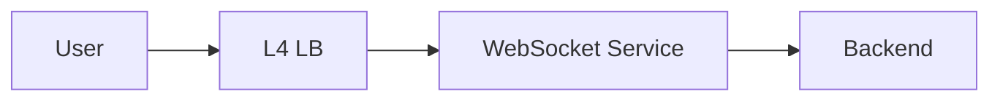
Use only when you need bidirectional, high-frequency (chat, live cursors) — not just server→client push.

### 5. WebRTC (peer-to-peer)
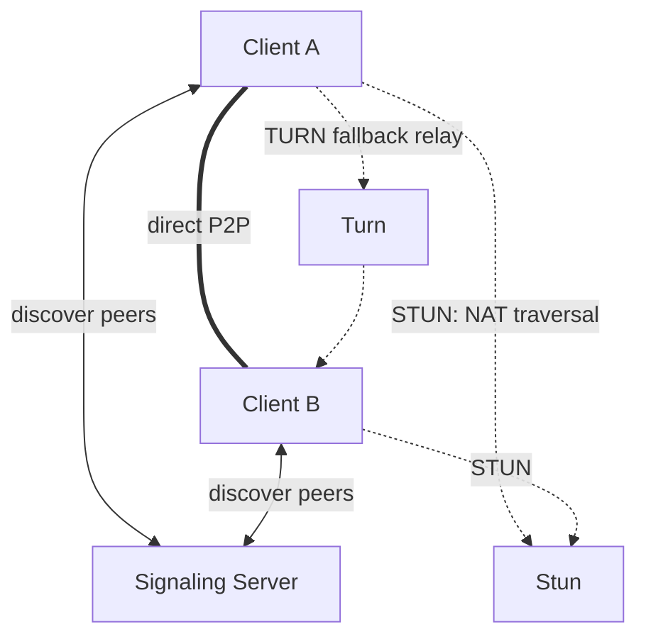
Lowest latency, offloads server cost, native A/V. Most complex — needs signaling/STUN/TURN. Use for calls, or P2P collab (Canva pointers, CRDT docs).

### Decision flow
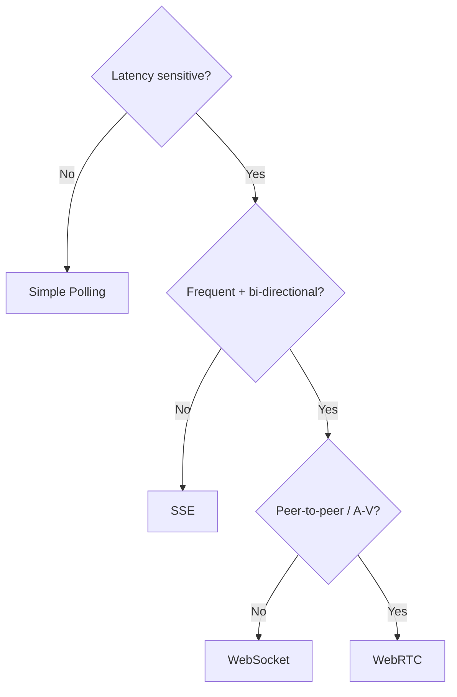

---

## Hop 2: Triggering the Server

### Pull via Polling
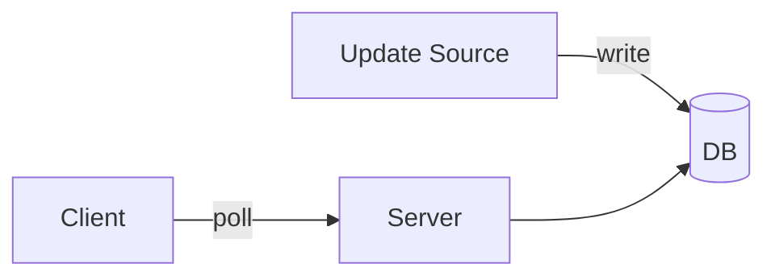
Decouples producer/consumer, but adds latency. Watch read QPS (1M clients × poll/10s = 100k TPS).

### Push via Consistent Hashing
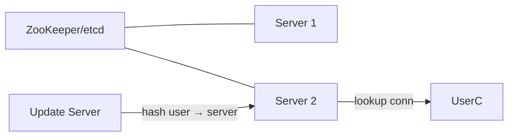
Each server owns a slice of users (hash ring, coordinated via ZK/etcd) — scaling only reshuffles a small slice, unlike modulo hashing. Use when connections hold expensive state (e.g. a loaded doc in Google Docs). Downside: complex, state lost if a node dies.

### Push via Pub/Sub
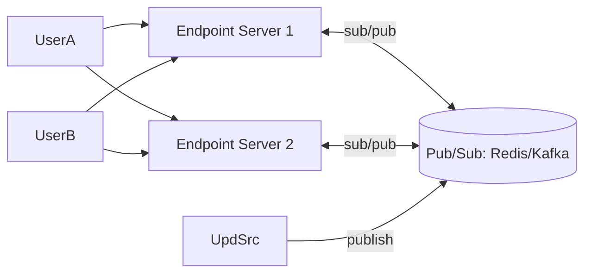
Endpoint servers are stateless/interchangeable — state lives in Pub/Sub. Default choice for broadcasting to many clients. Downsides: Pub/Sub is a SPOF/bottleneck (shard via Redis Cluster), no visibility into connect/disconnect, extra hop latency.

---

## Interview Notes
- Call out real-time needs early ("messages need instant delivery → WebSockets").
- Escalate only as needed: Polling → Long Polling → SSE → WebSocket → WebRTC.

| Scenario | Hop 1 | Hop 2 |
|---|---|---|
| Chat | WebSocket | Pub/Sub |
| Live comments (celebrity fan-out) | SSE/WS + hierarchical aggregation | Pub/Sub + batching |
| Collaborative doc editing | WebSocket (+ CRDT/OT) | Consistent hashing (doc = state) |
| Live dashboards | SSE | Pull polling or Pub/Sub |
| Gaming | WebRTC + WebSocket | Pub/Sub |

**Deep dives:**
- *Reconnection*: heartbeats detect zombie conns; track last-seen seq/ID per client to backfill on reconnect (Redis Streams).
- *Celebrity fan-out*: don't fan out writes per follower — cache once, distribute via hierarchical broadcast layers.
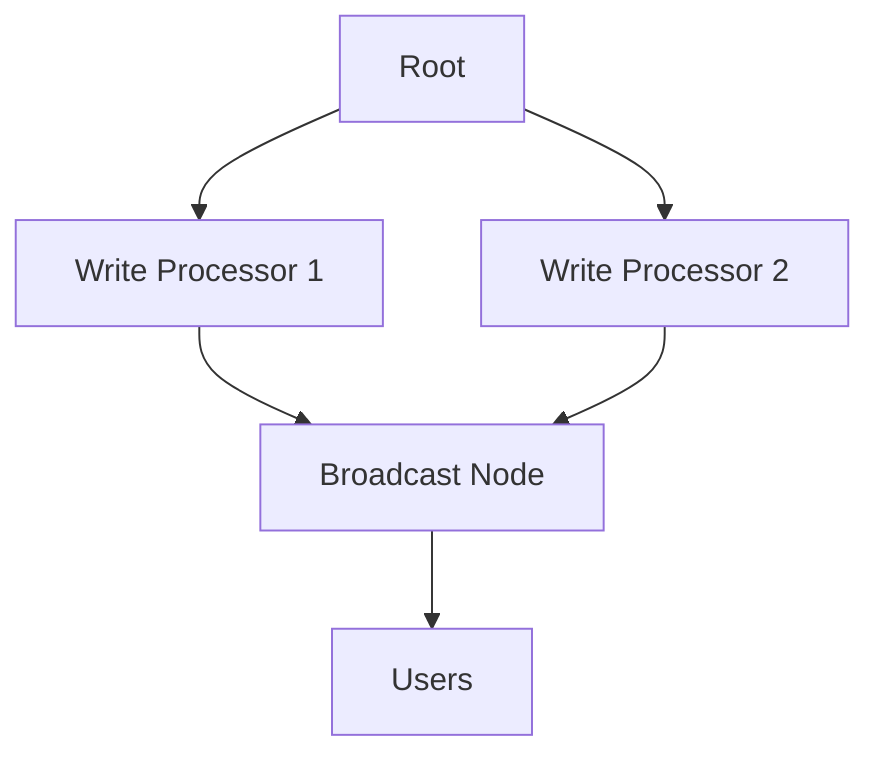
- *Ordering*: vector clocks in theory; in practice, funnel related messages through one server/partition and stamp a total order there.

## Bottom line
Two hops, five client protocols, three propagation patterns. Start simple, escalate only when latency/bidirectionality genuinely demands it.
